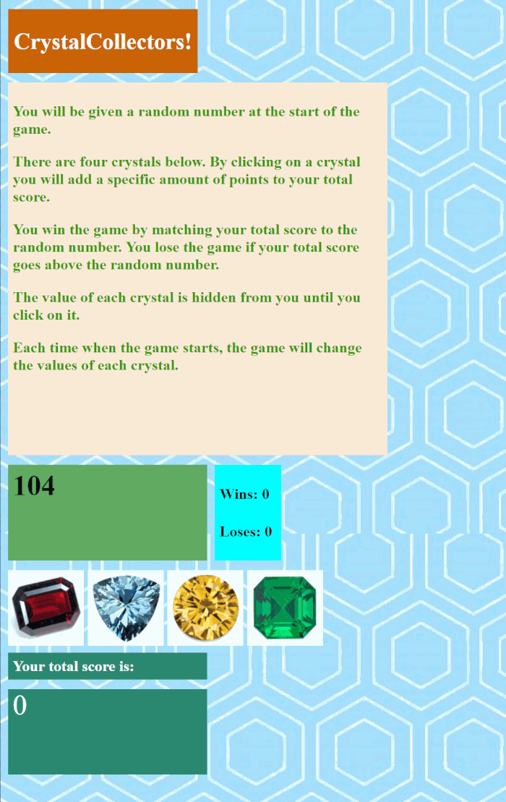

# Crystal-Collectors-Game
This is essentially a version of '21'. 4 cards with random values and you need to reach a random generated number.

This game begins with the Webpage showing a random number between 19 - 120. There are 4 gems that each have a random value bewteen 1-12. If the user adds his number for them to total the exact value of the random number shown, the wins increase by 1 and the game resets. If the user goes over the random number, the losses increase by 1 and the game resets. Each time the game is reset, the value of the gems and the random number change.

